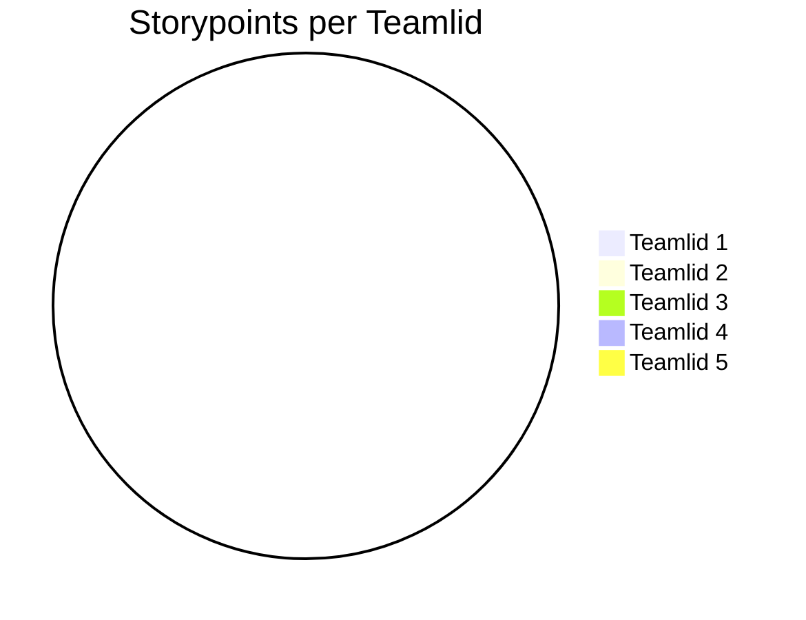

# Retrospective sprint 

Doe de retrospective m.b.v. een van de manieren op https://www.funretrospectives.com/category/retrospective/

>> Formuleer op basis hiervan concrete verbeterpunten voor de komende sprint

>> Geef elkaar feedback op basis van gedrag in de afgelopen sprint.

| Well | Not Well | New Ideas |
|-------|----------|-------------|
| Everyone was easily reachable and responded quickly in the group chat | Sometimes we talk past each other, which makes agreements unclear | At the start of each meeting, give a short summary of what was agreed before |
| We helped each other whenever someone got stuck | Not everyone always takes the same level of initiative to share ideas | At the start of each meeting, give a short summary of who the group is and what was worked on |
| Tasks were divided fairly | Deadlines were not always clearly agreed upon or met | At the end of each meeting, define clear to-do’s with responsible persons |
| There was a positive and respectful atmosphere | Sometimes too many things are discussed at once, which makes it chaotic | Use a fixed agenda and limit the number of topics per meeting |
| Everyone was open to feedback | Sometimes feedback is handled too quickly without proper discussion | Plan checkup moments at the end of each sprint before delivering the work |

## Aandeel teamleden

## Feedback voor teamleden

### Feedback teamlid

#### Tops

## Suleyman:
We can count on you, you bring a positive atmosphere

## Zarko:
You work efficiently, you are eager to help

## Davinio:
You are always there and show motivation

## Baran:
You bring positive energy, you are a real go-getter

## Matin:
You show strong technical insight and deliver reliable work

### Tips

## Suleyman:
You could be more active outside of school, and read the projects more carefully so you know better what needs to be done

## Zarko:
Try to share your ideas more often, and make your communication clearer

## Davinio:
Pay more attention to details in your work, and try to take breaks so you stay sharp

## Baran:
Keep a closer eye on your planning, and try to ask for feedback from the team more often

## Matin:
Try to communicate your progress more often, so the team knows what you are working on

#### Personal Reflections  

### Baran

During Sprint 1 I took an active role in the team when it came to discussing the project and and how we would make our designs.  

**As a TOP I received:**
“You bring positive energy, you are a real go-getter.”
I am glad this was noticed, because I think keeping momentum and motivation high is important for the whole team. I will continue to focus on keeping the team motivated and contributing actively.

**As a TIP I received:**
“Keep a closer eye on your planning, and try to ask for feedback from the team more often.”
I recognize this and I want to improve on it. For the next sprint, I will pay more attention to sticking to the planning and regularly ask the team for feedback on my work so I can adjust earlier if needed.

---

### Davinio  

During Sprint 1 I worked a lot on preparing the design and planning Sprint 2. Together with my team I made a Figma design that was approved, and we started writing the User Stories that still need approval from our PO. Based on my work in Sprint 1, I also received feedback from my team (see “Feedback for Team Members”).  

**As a TOP I received:**  
“You are always there and show motivation.”  
I am happy that I was able to show this in such a short sprint. I will continue to keep this up in the next sprints.  

**As a TIP I received:**  
“Pay more attention to details in your work, and try to take breaks so you stay sharp.”  
I reflected on this and decided that from the next sprint onward, I will pay more attention to details and avoid working too fast so that I reduce mistakes.  

---

### Zarko  

My development goal is to improve my communication and the sharing of ideas. I notice that I often work efficiently and like to help others, but I sometimes express my own thoughts and suggestions too little.  

**Concretely, in the next sprint I will work on this by:**  
- Sharing at least one idea or suggestion each week during the team meeting.  
- Communicating my updates and progress clearly in our group chat.  
- Asking at the end of each week whether my explanations were clear enough, so I can get feedback.  

**SMART Goal:**  
By the end of this sprint, I want to have actively shared my ideas at least four times in team meetings and received feedback confirming that my communication has become clearer.  

---

### Suleyman

During Sprint 1 I focused mostly on the preparing and designing of the election project. I try to get more involved into presenting the product during sprint reviews.

**As a TOP I received:**
“We can count on you, you bring a positive atmosphere.”
It is nice to hear that this is the effect I have on others I would like to keep this going._

**As a TIP I received:**
“You could be more active outside of school, and read the projects more carefully so you know better what needs to be done”
I have noticed this myself and want to try to get more invloved into the discusions that happen in the chat outside of school.

---

### Matin

During Sprint 1 I mainly worked on the technical setup of the project and helped with writing and reviewing code.  

**As a TOP I received:**  
“You show strong technical insight and deliver reliable work.”  
I am happy this was noticed, because I always try to make sure the project has a good base and works well. I will keep focusing on delivering quality and helping my teammates.  

**As a TIP I received:**  
“Try to communicate your progress more often, so the team knows what you are working on.”  
I agree with this and want to improve. Next sprint I will share more updates in the group chat and give short reports during meetings, so everyone knows what I am doing and we can work together better.  

