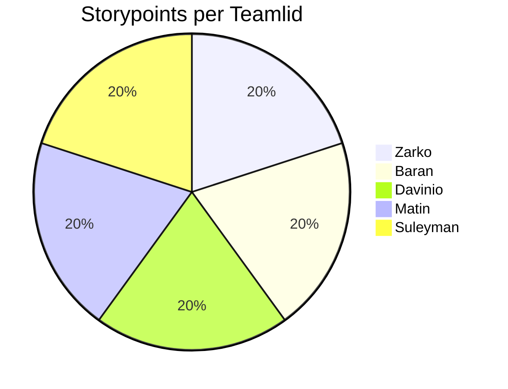

# Retrospective sprint 1

## Proportion team members

## Feedback for team members

### Tops

#### Suleyman:
You deliver reliable work.

#### Zarko:
You're an excellent motivator and very encouraging.

#### Davinio:
You often take the reins.

#### Baran:
You often offered to do open tasks.

#### Matin:
You communicated a lot more with the team this sprint.

### Tips

#### Suleyman:
Appear on time.

#### Zarko:
Stick closer to the planning to avoid stress and last-minute conflicts. Start on the work sooner.

#### Davinio:
Give the team updates on your progress more frequently.

#### Baran:

#### Matin:
Stick closer to the planning to avoid stress and last-minute conflicts. Start on the work sooner.

## Personal Reflections  

### Baran

“You often offered to do open tasks.”
I’m happy that my willingness to take initiative was noticed. I believe that helping the team move forward, especially when something is left open, contributes to a more efficient and supportive workflow.

As a TIP I received:
“Make sure to balance taking initiative with communicating your workload to the team.”
Sometimes, by taking on extra tasks, I risk spreading myself too thin or not keeping others informed about my progress. In the next sprint, I want to focus more on communicating what I’m working on and making sure tasks are distributed evenly within the team, and making sure to let my team know when I need help.

Reflection:
During Sprint 2, I became more active and offered to take on open tasks to help the team stay on schedule. While this helped us move forward efficiently, I realized that it’s just as important to remain transparent about my workload. In the next sprint, I’ll focus on finding a better balance between initiative and communication. Continuing to contribute actively, but also ensuring that everyone stays aligned and aware of each other’s progress.

---

### Davinio
During **Sprint 2**, I focused more on the development side of our project. After finalizing the design in Sprint 1, my main goal was to start implementing the front-end based on our approved Figma. I worked on setting up the project structure, coding several components, and collaborating with my teammates to make sure our designs were correctly translated into the application.  
 
I also made sure to apply the feedback I received from the first sprint. I took more time to double-check my work before submitting it for review, which helped me catch small mistakes earlier. I also tried to take short breaks during work sessions, and I noticed that it helped me stay more focused and productive.  
 
**As a TOP I received:**  
“You are reliable and communicate well with the team.”  
I’m glad that my teammates noticed my effort in keeping communication clear and consistent. This motivated me to continue being a dependable team member and support others when needed.  
 
**As a TIP I received:**  
“Try to plan your time more efficiently to avoid last-minute stress.”  
I agree with this feedback, and for the next sprint, I plan to use a more structured schedule to divide my tasks evenly throughout the week. This should help me stay on track and manage my time better, especially when multiple deadlines overlap.  
 
### SMART Learning Goals  
 
**1. Time Management & Planning**  
- **Specific:** I want to manage my time better by creating a daily task plan at the start of each workday.  
- **Measurable:** By the end of each week, I will have completed at least 90% of my planned tasks.  
- **Achievable:** This goal is realistic within our sprint planning and supports better team performance.  
- **Relevant:** It directly helps reduce last-minute stress and improves overall workflow.  
- **Time-bound:** I will apply this approach consistently during the next two sprints.  
 
**2. Quality & Attention to Detail**  
- **Specific:** I want to reduce the number of corrections I receive during code reviews by paying more attention to details.  
- **Measurable:** The number of requested corrections per review should decrease by at least 30% by the end of Sprint 3.  
- **Achievable:** By reviewing my work carefully before submitting, this goal is realistic and within my control.  
- **Relevant:** It contributes directly to improving project quality and efficiency.  
- **Time-bound:** I aim to achieve this by the end of Sprint 3.  

---

### Sprint Reflection – Zarko

During this sprint, I received positive feedback that I was very motivating and brought a lot of energy to the team. I’m glad that my enthusiasm helped to keep team morale high and encouraged collaboration. I believe maintaining a positive attitude within the group is one of my strengths, as it helps us stay productive and engaged, especially when facing challenges.  

However, one point for improvement was that I should stick to the planning more closely to prevent potential issues. I noticed that sometimes I focused too much on helping others or working on multiple tasks at once, which made it harder to follow the original plan strictly. This occasionally led to minor delays or last-minute adjustments.  

To improve this, I’ve created the following **SMART goal** for the next sprint:  

> **I want to stick to my planning more consistently by reviewing and updating my tasks during every stand-up meeting, so that I stay on track with deadlines and avoid last-minute issues. I will evaluate my progress in each stand-up by checking whether I’m up to date with my planned tasks.**

By doing this, I aim to maintain my motivating presence in the team while becoming more structured and reliable in my task management. Regularly reflecting on my progress during stand-ups will help me stay organized and ensure that my positive energy also contributes to better planning and smoother teamwork.

---

### Suleyman
The tip recieved last sprint was that I should be more active on communicating outside of school. I think I greatly improved in this area and replied more often to messages in the groupchat. An area I could improve on is the work process since I didn't update the sprintboard often enough.\

As a TOP I received:"You deliver reliable work" It is good to hear the work I produce is considerd reliable. I would like to keep this going and improve it nexr sprint by delivering work faster.

As a TIP I received:"Appear on time" I recognize that appearing on time is important for team collaboration and planning, so I will make sure to arrive on time for meetings and work sessions.

SMART Learning Goal:
By the end of the next sprint (in two weeks), I will update the sprint board at least twice per week and check the group chat daily to ensure consistent communication and transparency about my progress. I will also make sure to be on time for every meeting to strengthen my reliability within the team.

---

### Matin