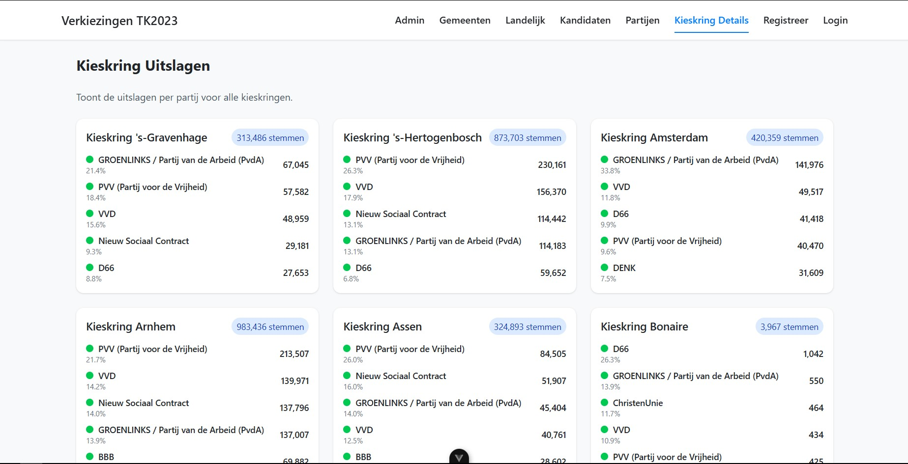

# Kieskringen Pagina Documentatie

Dit document beschrijft de functionaliteit en het ontwerp van de kieskringen pagina, zoals weergegeven is in de afbeelding.

## Componenten

De pagina is opgebouwd uit een raster van kaarten, waarbij elke kaart een specifieke kieskring vertegenwoordigt. Zoals te zien is in de afbeelding, zijn er kaarten voor onder andere 's-Gravenhage, 's-Hertogenbosch, Amsterdam, Arnhem, Assen en Bonaire etc.

### Kieskring Kaart

Elke kieskring kaart bevat de volgende informatie:

* **Naam van de Kieskring:** Bovenaan elke kaart staat de naam van de kieskring (bijv. "Kieskring 's-Gravenhage").
* **Totaal aantal stemmen:** Direct onder de naam van de kieskring wordt het totale aantal stemmen voor die specifieke kieskring weergegeven in een opvallende blauwe pil (bijv. "313.486 stemmen").
* **Top 5 Partijen:** Voor elke kieskring worden de top 5 populairste partijen getoond, gesorteerd op percentage:
    * **Partijnaam:** De naam van de partij (bijv. "groenlinks" / Partij van de Arbeid (PvdA)").
    * **Percentage:** Het percentage van de stemmen dat de partij heeft behaald binnen de kieskring (bijv. "21.4%").
    * **Aantal stemmen:** Het absolute aantal stemmen dat de partij heeft ontvangen (bijv. "67,045").
    * **Visuele indicatie:** Elke partij wordt voorafgegaan door een gekleurde stip, die waarschijnlijk dient als een visuele indicator of legende voor de partijkleur, hoewel de legende zelf niet zichtbaar is in deze afbeelding.

## Functionaliteit

* **Overzicht van Resultaten:** Gebruikers kunnen in één keer de verkiezingsresultaten voor verschillende kieskringen vergelijken.
* **Detailinformatie per Partij:** Binnen elke kieskringkaart is direct zichtbaar welke partijen het meest populair zijn en met welke percentages en aantallen stemmen.
* **Navigatie (impliciet):** Hoewel niet direct zichtbaar in de afbeelding, suggereert de URL-structuur en de aanwezigheid van een "Kieskring Details" link in de header dat er mogelijk een gedetailleerdere pagina per kieskring is.

## Ontwerpoverwegingen

* **Duidelijkheid:** Het ontwerp is helder en overzichtelijk, waardoor de belangrijkste informatie snel te vinden is.
* **Consistentie:** De structuur van elke kieskringkaart is consistent, wat de bruikbaarheid bebeter maakt.
* **Bruikbaarheid:** De percentages en aantallen stemmen zijn weergegeven, wat belangrijk is voor het begrijpen van de resultaten.
