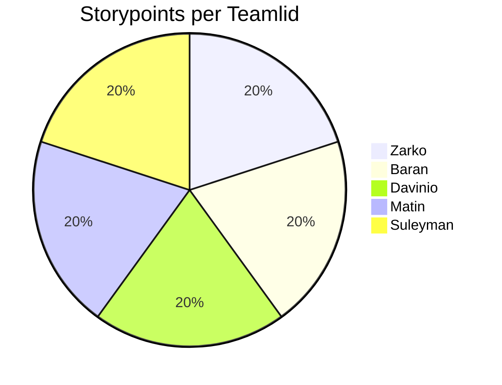

| Well                                                                                             | Not Well                                                                | New Ideas |
|--------------------------------------------------------------------------------------------------|-------------------------------------------------------------------------|-------------|
| Everyone was easily reachable and responded quickly in the group chat just like previous sprints | Contact with Product owner was practically none exitent.                | Unit tests, can be added to CI/CD|
| We helped each other whenever someone got stuck and the "vibe" in the team was possitve.         | We still have to many brenches.                                         | Infra & Docker & Deployen & CI/CD |
| Tasks were divided fairly, and we made enough amount of user stories.                            | Improve UI/UX with TMC and look at Accessability                        | Chat is also coming up |
| We improved the daily stand-ups, and we focused more on our documentation.                       | Sometimes too many things are discussed at once, which makes it chaotic | Use a fixed agenda and limit the number of topics per meeting |
| Everyone was open to feedback and easy going.                                                    | 4 a 5 dagen per week aan studie besteden                                | Plan checkup moments at the end of each sprint before delivering the work |

# SMART Learning Goals – Team Level
 
---

## 1. Improve Sprint Planning & Task Start Time

**Specific:** The team will begin assigned tasks within 24 hours after the sprint planning meeting.

**Measurable:** At least 90% of tasks will be moved to “In Progress” or even “Done” within the first few days of the sprint.

**Achievable:** By improving clarity in sprint planning and assigning tasks early, this is realistic.

**Relevant:** Early task initiation helps prevent last-minute stress and workload imbalance.

**Time-bound:** To be achieved consistently starting in Sprint 3 and evaluated at the next retrospective.
 
---

## 2. Strengthen Communication & Transparency

**Specific:** Each team member will update the sprint board and post a short progress message in the group chat at least twice per week.

**Measurable:** The board should reflect active updates from all five team members weekly.

**Achievable:** These updates require minimal time and can be done during stand-ups or at the end of the workday.

**Relevant:** Improves alignment, reduces misunderstandings, and supports teamwork.

**Time-bound:** Implemented for the duration of Sprint 3 and reviewed during the next retrospective.
 
---

## 3. Enhance Time Management & Reliability

**Specific:** The team will collectively ensure that all sprint tasks are completed by 24 hours before the sprint review to allow time for testing and adjustments.

**Measurable:** At least 90% of sprint tasks will be marked as “Done” one day before the sprint review.

**Achievable:** With better planning and communication, this timeline is realistic.

**Relevant:** Reduces last-minute stress and improves the quality of deliverables.

**Time-bound:** To be achieved in Sprint 3, evaluated in the Sprint 3 Retrospective.

 
## Davinio's reflection

During Sprint 3, I continued to build on my development tasks and focused on improving my workflow within the team. This sprint, I made sure to complete my user stories on time and stayed consistent with the planning we created together. I also paid more attention to the merging process, ensuring that my code was of good quality before submitting a merge request.

One point of feedback I received was a reminder to communicate more clearly when making or verifying merge requests. In the previous sprint, I sometimes informed only one teammate, which could slow down the reviewing process. Moving forward, I will make sure to notify the entire team so that everyone stays aligned and reviews can happen more efficiently.

This sprint also helped me become more confident in handling tasks independently while still staying connected with the group. I took more initiative in certain areas, but I also learned the importance of keeping everyone in the loop to maintain smooth teamwork.

**TOP**

* You have your user stories done and closed on time, and you follow the plannings.
* I took initiative when needed and helped keep the project moving forward.
* I maintained steady communication about my progress throughout the sprint.
* I was reliable when it comes to explaining what ive learned, such as working with the database.

**TIP**

* “When making and verifying a merge request, make sure to let the whole team know instead of just one person.”
* Ask for feedback earlier in the development process to prevent last-minute changes.
* Involve teammates more when making decisions that affect the project.
* Continue refining time management by breaking tasks into smaller steps to stay ahead of deadlines.

---

## Zarko’s Reflection

During this sprint, I kept bringing positive energy to the team. I’m glad that my enthusiasm helped keep everyone motivated and working well together. Staying positive is one of my strengths, and it really helps the team when we face challenges.

My goal for this sprint was to follow my plan more closely by checking my tasks during each stand-up meeting. I did this regularly, which helped me stay more organized and finish my work on time. Because of that, I didn’t have as many last-minute changes as before.

I think I’ve improved in managing my time and tasks while still supporting my teammates. I was able to keep my positive attitude and also stay more focused on my own goals.

**SMART Goal for the Next Sprint:**  
I want to make commits more often, at least a few times each day, to keep the workflow smooth and the project more organized. I will track this by checking at the end of each day if I’ve made regular commits and shared my progress with the team.  
By doing this, I hope to make teamwork easier, keep everyone updated, and help us avoid confusion with code changes.

**TOP**

- I stayed positive and motivated the team during the sprint.  
- I improved how I plan and follow my tasks each day.  
- I helped keep the team spirit high and supported others when needed.  
- I became more organized and had fewer last-minute issues.

**TIP**

- Keep improving planning by keeping a clear daily focus.  
- Try to communicate small updates more often during the day.  
- Make multiple commits daily to keep progress visible and the workflow smoother.  
- Keep balancing teamwork with personal task management.

---

## Matin - Sprint Reflection

Last sprint, my tip was to share blockers earlier so the team can help faster.  
I improved by updating the sprint board more often and joining team discussions,  
but I can still get better at sharing updates quickly when I face problems.
 
**TOP:**
**You kept the sprint board updated and improved team transparency.**  
I’m happy with this feedback and will keep giving regular updates.
 
**TIP:**
**Share blockers or challenges as soon as they happen.**  
This helps the team react faster and keeps progress steady.
 
**SMART Learning Goal:**  
By the end of the next sprint (in three weeks):  
- I will post **at least two progress or blocker updates per week** in the group chat.  
- I will update my sprint board **after every major progress step**.  
 
This will make communication clearer and help the team work more smoothly together.
 
---

## Suleyman - Sprint Reflection
Last sprint, the tip I received was to communicate more consistently. I improved by being more active in the group chat, but I can still do better by committing my code more frequently to show progress throughout the day.  
 
**TOP:** *You deliver your tasks on time and reliably.*  
I’m happy with this feedback and want to keep that up while improving how I share progress with the team.  
 
**TIP:** *Commit more often to GitLab to make your progress visible.*  
I agree, frequent commits help the team follow along and make collaboration smoother.  
 
**SMART Learning Goal:**  
By the end of the next sprint (in three weeks), I will commit to **GitLab at least five times per day** and keep the sprint board updated regularly to maintain transparency and consistent progress.

---

## Baran - Sprint Reflection

Last sprint, my goal was to communicate more clearly about my workload and progress.  
I made an effort to be more transparent about what I was working on and how much I could take on, which helped the team coordinate better and made it easier to share updates or ask for support when needed.  

**TOP:**  
**You communicated more clearly about your workload and progress this sprint.**  
I’m proud of this improvement — it helped build trust and made collaboration smoother across the team.  

**TIP:**  
**Continue improving how you prioritize tasks so you can maintain a steady balance between initiative and focus.**  
While my communication improved, I sometimes found myself taking on too many smaller tasks. For the next sprint, I’ll focus on prioritizing high-impact work and finishing tasks fully before moving on.  

**SMART Learning Goal:**  
By the end of the next sprint (in three weeks):  
- I will **identify and prioritize my top three impact tasks** at the start of each week.  
- I will **finish or hand off one key task before starting a new one** to maintain focus.  
- I will **continue sharing workload updates twice a week** to keep communication strong.  

This will help me balance initiative with focus, ensuring steady and meaningful progress throughout the sprint.
