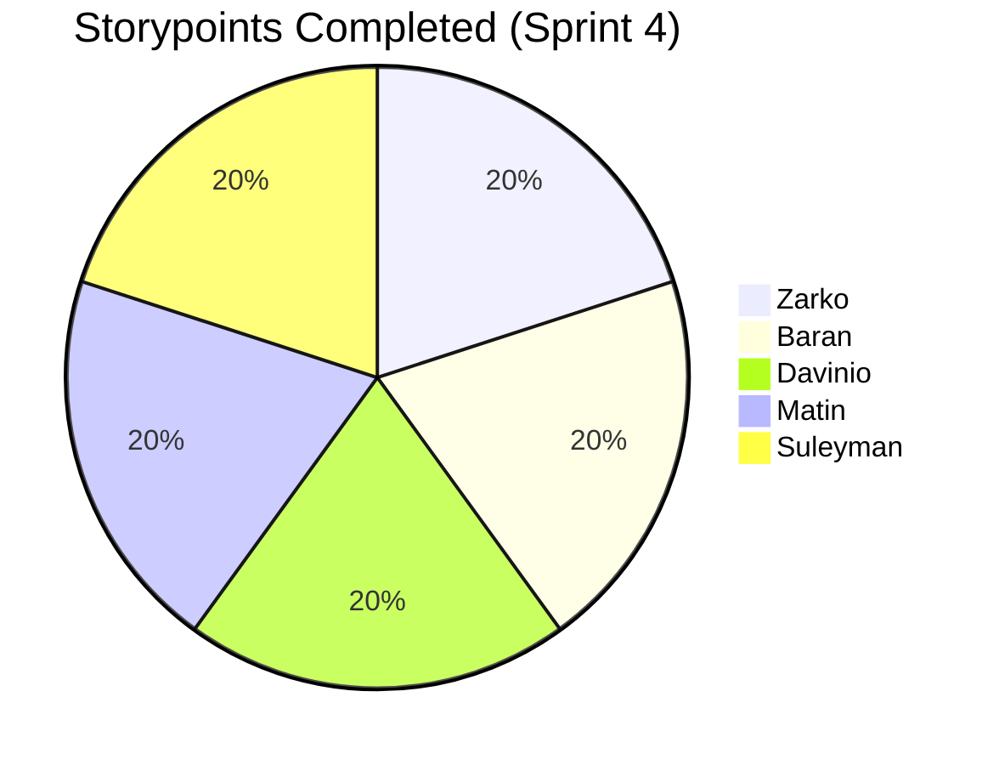

# Retrospective – Sprint 4

## The "Sailboat" Retro Drawing

```mermaid
graph TD
    subgraph " "
    A((⛵ THE BOAT)) -->|Represents| B[The Team & Scope]
    end
    
    subgraph " "
    C((🌬️ WIND)) -->|Represents| D[What is pushing us forward?]
    D -.-> D1[Better PO Contact]
    D -.-> D2[Automated Testing]
    end
    
    subgraph " "
    E((⚓ ANCHORS)) -->|Represents| F[What is slowing us down?]
    F -.-> F1[Waiting for Code Reviews]
    F -.-> F2[Complex Docker Configs]
    end
    
    subgraph " "
    G((🏝️ ISLAND)) -->|Represents| H[The Goal / Definition of Done]
    end
    
    subgraph " "
    I((🪨 ROCKS)) -->|Represents| J[Risks / Future Obstacles]
    J -.-> J1[Merge Conflicts near deadline]
    end
    
    style A fill:#f9f,stroke:#333
    style C fill:#ccf,stroke:#333
    style E fill:#f99,stroke:#333
    style G fill:#9f9,stroke:#333
    style I fill:#ccc,stroke:#333
```

-----

## Retrospective Grid

| Well (What we kept doing / Improved)                                                                | Not Well (Current Struggles)                                                                                                                                                              | New Ideas (Actions / 行動)                                                                            |
|:----------------------------------------------------------------------------------------------------|:------------------------------------------------------------------------------------------------------------------------------------------------------------------------------------------|:----------------------------------------------------------------------------------------------------|
|                                                                                                     | **Code Review Bottlenecks:** Because everyone is committing faster, PRs pile up and wait too long for review.                                                                             | **Pair Programming:** Implement strict pair programming for complex tasks to skip review wait times. |
| **Meeting Structure:** The fixed agenda worked perfectly; stand-ups were efficient and not chaotic. | **Connection with PO:  ** We failed to establish better communication with our PO.                                                                                                     | |**Docker/Infra Complexity:** Some team members struggled with the new Docker container setup locally. | **Documentation Day:** Dedicate the first half-day of Sprint 5 to finalizing README and installation guides. |
| **Branch Management:** We kept branches clean and merged often. No more "too many branches."        | **Testing Curve:** Writing Unit Tests took longer than expected (learning curve).                                                                                                         | **Automated Linting:** Add a linter to the CI/CD pipeline to catch style errors automatically.      |
| **Task Start Time:** Everyone started tasks within 24h of planning (Goal Achieved).                 |                                                                                                                                                                                           | **Final Polish:** Start focusing on UI consistency for the final presentation.                      |

-----

## Story Points per Team Member

-----

# SMART Learning Goals – Team Level (Sprint 5)

## 1\. Optimize Code Review Speed

**Specific:** No Merge Request (MR) should remain open/unreviewed for more than 24 hours.
**Measurable:** GitLab logs show average time-to-merge is under 24 hours.
**Achievable:** By prioritizing reviews explicitly during daily stand-ups.
**Relevant:** Prevents the "bottleneck" issue identified in the retro.
**Time-bound:** End of Sprint 5.

## 2\. Increase Test Coverage

**Specific:** Every new User Story must include at least one corresponding Unit Test or Integration Test.
**Measurable:** Test coverage report shows an increase of at least 10% by end of sprint.
**Achievable:** We have learned the basics of testing in Sprint 4.
**Relevant:** Ensures stability before the final product delivery.
**Time-bound:** Continuous throughout Sprint 5.

-----

# Individual Reflections

## Davinio's Reflection

In Sprint 4, I really focused on the feedback from the last retro regarding communication. I made sure to post in the group chat immediately when creating a Merge Request, tagging the whole team rather than just one person. This helped us merge things faster. I also took the lead on the Docker implementation, which was challenging but rewarding.

**TOP**

* Successfully implemented the initial Docker containers for the project.
* Communicated clearly to the whole group when MRs were ready.
* Helped teammates troubleshoot local environment issues.

**TIP**

* Sometimes I dive too deep into technical details (like Docker) and forget to update the board for a few hours.
* Next step: Create a "How-to" doc for the Docker setup so others can learn.

-----

## Zarko’s Reflection

I achieved my goal of making more frequent commits. Instead of one big push at the end of the day, I pushed small changes 3-4 times a day. This made it much easier for Davinio and Baran to review my code. I also maintained the positive energy, especially when we got stuck on the unit tests.

**TOP**

* Consistent daily commits kept the workflow smooth.
* Kept the team motivated during the difficult testing phase.
* Followed the new meeting agenda strictly.

**TIP**

* Now that I am committing often, I need to make sure my commit *messages* are more descriptive.
* Start picking up slightly more complex backend tasks to challenge myself.

-----

## Matin's Reflection

I met my goal of posting updates twice a week and updating the board. I actually updated the board daily\! I felt much more connected to the team this sprint. I also raised a "blocker" immediately when the database migration failed, which saved us a lot of time.

**TOP**

* Excellent transparency; the board was always up to date.
* Shared blockers instantly, allowing the team to swarm and fix the DB issue.
* Participated actively in the improved, structured discussions.

**TIP**

* While I update the board well, I can be more proactive in *reviewing* others' code.
* Focus on learning the testing framework to help Suleyman and the team.

-----

## Suleyman's Reflection

I focused heavily on my goal: committing 5 times a day. I didn't always hit 5, but I was much more consistent than Sprint 3. I also took ownership of the Unit Testing research. It was hard, but I delivered the first working test suite.

**TOP**

* Greatly improved commit frequency and visibility on GitLab.
* Pioneered the Unit Testing setup (New Idea from last sprint).
* Reliable attendance and participation in stand-ups.

**TIP**

* Sometimes my "In Progress" tasks stay there a bit too long; I should break them down further.
* Need to pair with Matin to share the testing knowledge.

-----

## Baran's Reflection

I stuck to my goal of prioritizing "Top 3 Tasks." This stopped me from context-switching too much. I finished my main feature (User Profile UI) fully before helping others. I also felt the communication with the PO went well, and I helped facilitate that meeting.

**TOP**

* Excellent prioritization; finished tasks fully before moving on.
* Helped bridge the gap between the team and the Product Owner.
* Improved work-life balance by sticking to the schedule.

**TIP**

* I can improve by taking on more "Infrastructure" tasks (like CI/CD) rather than just UI.
* Ensure that when I finish a task, I immediately check the "Review" column to unblock others.