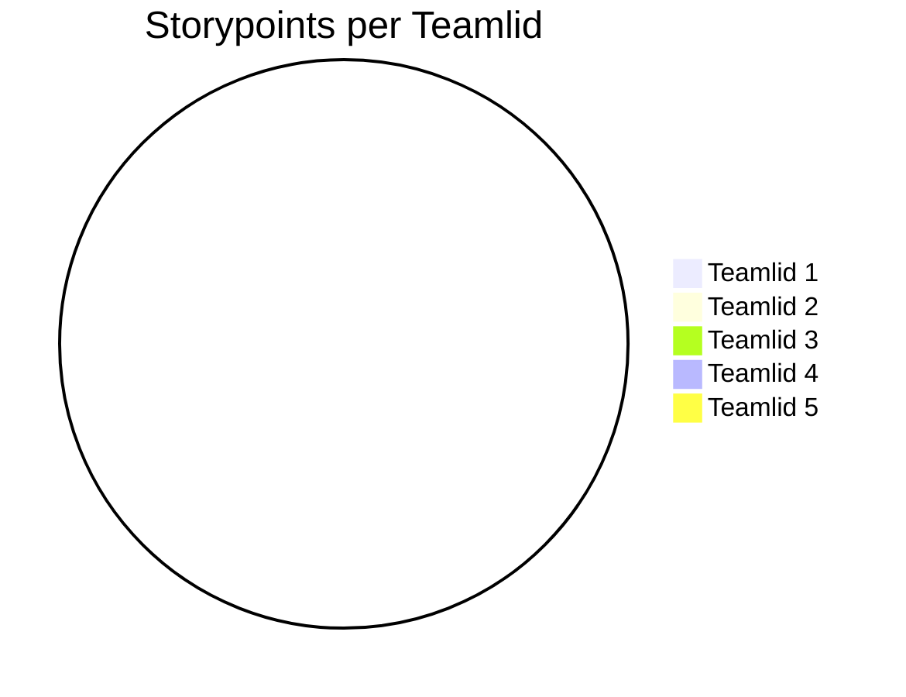

# Retrospective sprint 

// Alle tekst met // weghalen voordat je het op DLO zet. Zorg dat het document er verzorgd uitziet.

// De retrospective doe je met je team.

Doe de retrospective m.b.v. een van de manieren op https://www.funretrospectives.com/category/retrospective/

>> Formuleer op basis hiervan concrete verbeterpunten voor de komende sprint

>> Geef elkaar feedback op basis van gedrag in de afgelopen sprint.

## Uitkomst retrospective

# Project Feedback & Ideas

| Well | Not Well | New Ideas |
|-------|----------|-------------|
| Figma design ziet er goed uit | Speak as a team (not as individuals) | Must use WebSockets (current version is non-functional) |
| Personas zien er professioneel uit | Always start with what the project is about and who the team is | Admin should have the ability to moderate chat (e.g., delete users) |
| De requirements zijn voldaan | Think carefully about data storage structure | Chat accounts should be connected to login & register system (with CORS, WebSocket, JWT token, Spring Boot) |
| | | Focus first on showing results we already have (since election dates are not yet available) |
| | | Show stats that go up and down on multiple levels (province, national, and others) |
| | | The product should be interactive |
| | | Each user story should be vertical (from frontend to backend) |
| | | Parse data from XML into the database |
| | | Admin panel improvements: smaller panel, no adding parties/politicians, new button for election data |
| | | Add moderation tools for the chat |
| | | Channels: one big channel for now, multiple channels = "should have" |
| | | Comparing a party with itself is the main focus |

## Aandeel teamleden

// Geef per teamlid aan hoeveel storypoints of werk hij/zij deze sprint heeft kunnen realiseren. Vervang hieronder de namen van de teamleden en geef per teamlid het aantal storypoints. De mermaid code genereert vervolgens een pie-chart. 

// Geef onder de pie chart een korte toelichting: wat valt op?  Kunnen jullie de verschillen verklaren?

## Feedback voor teamleden

// Geef hieronder zo specifiek mogelijke feedback voor elk teamlid.

// tip: bereid de feedback op je teamleden eerst individueel voor en ga dan pas samen zitten.

// herhaal onderstaande kopjes voor elk teamlid.

### Feedback teamlid

#### Tops

// gezamenlijk zorg je per teamlid voor minimaal 2 complimenten.

### Tips

// gezamenlijk zorg je per teamlid voor minimaal 2 tips.

##### Eigen reflectie

// Geef een persoonlijk ontwikkeldoel aan en vertel concreet hoe je hier de komende sprint aan gaat werken (maak het SMART).

->>>>> DLO, upload per persoon op de DLO een doc. 

Noem deze retrospective sprint + nummer (zodat we weten waar het over gaat)
