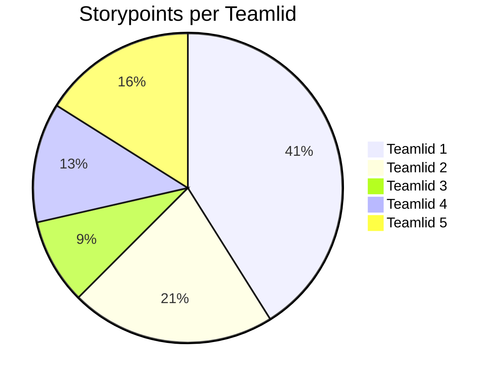

# Retrospective sprint 

// Alle tekst met // weghalen voordat je het op DLO zet. Zorg dat het document er verzorgd uitziet.

// De retrospective doe je met je team.

Doe de retrospective m.b.v. een van de manieren op https://www.funretrospectives.com/category/retrospective/

>> Formuleer op basis hiervan concrete verbeterpunten voor de komende sprint

>> Geef elkaar feedback op basis van gedrag in de afgelopen sprint.

## Uitkomst retrospective

Plaats de uitkomsten hier.

## Aandeel teamleden

// Geef per teamlid aan hoeveel storypoints of werk hij/zij deze sprint heeft kunnen realiseren. Vervang hieronder de namen van de teamleden en geef per teamlid het aantal storypoints. De mermaid code genereert vervolgens een pie-chart. 

// Geef onder de pie chart een korte toelichting: wat valt op?  Kunnen jullie de verschillen verklaren?

## Feedback voor teamleden

// Geef hieronder zo specifiek mogelijke feedback voor elk teamlid.

// tip: bereid de feedback op je teamleden eerst individueel voor en ga dan pas samen zitten.

// herhaal onderstaande kopjes voor elk teamlid.

### Feedback teamlid

#### Tops

## Suleyman:
We kunnen op je bouwen, je brengt een fijne sfeer  

## Zarko:
Je werkt efficiënt, je wilt graag helpen  

## Davinio:
Je bent er altijd en laat motivatie zien  

## Baran:
Je hebt een positieve energie, je bent een echte doorzetter  

### Tips

## Suleyman:
Je kan wat vaker actief zijn naast school, je zou de projecten beter kunnen inlezen zodat je beter weet wat we moeten doen  

## Zarko:
Probeer je ideeën vaker te delen, je kunt je communicatie nog duidelijker maken  

## Davinio:
Let wat meer op details bij je werk, probeer soms ook rust te nemen zodat je scherp blijft  

## Baran:
Je zou je planning iets beter kunnen bewaken, probeer ook vaker feedback te vragen aan het team  

##### Eigen reflectie

// Geef een persoonlijk ontwikkeldoel aan en vertel concreet hoe je hier de komende sprint aan gaat werken (maak het SMART).

->>>>> DLO, upload per persoon op de DLO een doc. 

Noem deze retrospective sprint + nummer (zodat we weten waar het over gaat)
